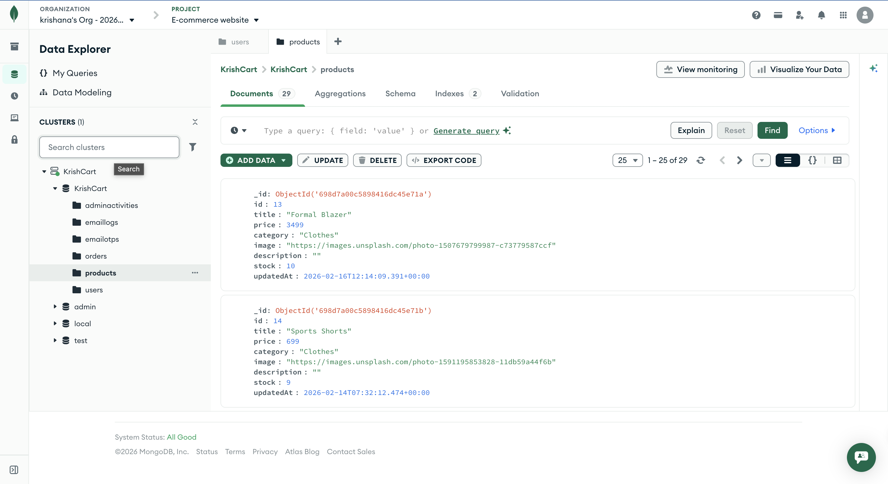

# 🛒 KrishCart – Full Stack MERN E-Commerce Platform


---

## 🚀 Project Overview

**KrishCart** is a production-ready full-stack e-commerce web application built using the MERN stack.  
It allows users to browse products, register, log in securely using JWT authentication, add items to cart, place orders, and view order history.

All data is persisted in MongoDB Atlas and the application is fully deployed on Render.

---

## 🌐 Live Demo

- 🔗 Frontend: https://e-commerce-website-frontend-kz6e.onrender.com
- 🔗 Backend API: https://e-commerce-website-backend-f1ka.onrender.com

---

## ✨ Features

- 🔐 JWT-based Authentication (Register / Login)
- 👤 Secure User Profile Route
- 🛍️ Product Listing & Product Details
- 🛒 Add to Cart & Checkout (Fake Payment Flow)
- 📦 Order Creation & Order History
- 🗄️ MongoDB Atlas Integration
- 📱 Fully Responsive UI
- ☁️ Full Deployment on Render

---

## 🛠️ Tech Stack

### Frontend

- React.js (Vite)
- Tailwind CSS
- Axios
- React Router DOM
- Context API

### Backend

- Node.js
- Express.js
- MongoDB Atlas
- Mongoose ODM
- JWT Authentication
- Bcrypt Password Hashing

### Deployment

- Render

---

## 📂 Project Structure

```bash
KrishCart/
├── backend/
│   ├── controllers/
│   ├── middleware/
│   ├── models/
│   ├── routes/
│   ├── config/
│   ├── index.js
│   └── .env
│
├── react-ecommerce/
│   ├── src/
│   │   ├── Components/
│   │   ├── Pages/
│   │   ├── Context/
│   │   ├── services/
│   │   └── utils/
│   └── vite.config.js
│
└── README.md

```

---

## ⚙️ Setup Instructions

### Prerequisites

- Node.js (v16+)
- npm
- MongoDB Atlas Account

---

### 1️⃣ Clone Repository

```bash
git clone https://github.com/Krishnayadav1908/E-Commerce-Website.git
cd E-Commerce-Website

```

### 2️⃣ Install Dependencies

# Backend

cd backend
npm install

# Frontend

cd ../react-ecommerce
npm install

### 3️⃣ Environment Variables

Create .env file inside the backend/ folder:
MONGODB_URI=your_mongodb_connection_string
JWT_SECRET=your_secret_key
PORT=3000

Create .env inside react-ecommerce/:
VITE_API_URL=http://localhost:3000

### 4️⃣ Run Application

# Start Backend

cd backend
npm start

# Start Frontend

cd ../react-ecommerce
npm run dev
Frontend → http://localhost:5173  
Backend → http://localhost:3000

---

## 🔗 API Endpoints

### 🔐 Authentication

- **POST** `/api/auth/register` – Register new user
- **POST** `/api/auth/login` – Login user
- **GET** `/api/auth/profile` – Get logged-in user profile

---

### 🛍️ Products

- **GET** `/api/products`
- **GET** `/api/products/:id`

---

### 📦 Orders

- **POST** `/api/orders`
- **GET** `/api/orders`

---

```
## 🏗️ Application Architecture
┌───────────────────────────────┐
│           Frontend            │
│  React.js + Context API       │
└───────────────┬───────────────┘
│
▼
Axios HTTP Requests
│
▼
┌───────────────────────────────┐
│            Backend            │
│        Express.js REST API    │
└───────────────┬───────────────┘
│
▼
JWT Authentication
(Middleware Layer)
│
▼
┌───────────────────────────────┐
│          Database             │
│   MongoDB Atlas (Mongoose)    │
└───────────────────────────────┘
```

---

<table>
  <tr>
    <td></td>
    <td></td>
  </tr>
  <tr>
    <td align="center"><b>Home - Product Listing</b></td>
    <td align="center"><b>Category Filter</b></td>
  </tr>
  <tr>
    <td></td>
    <td></td>
  </tr>
  <tr>
    <td align="center"><b>Product Detail</b></td>
    <td align="center"><b>Shopping Cart</b></td>
  </tr>
    <tr>
    <td></td>
    <td></td>
  </tr>
  <tr>
    <td align="center"><b>Sign In Page</b></td>
    <td align="center"><b>Sign Up Page</b></td>
  </tr>
</table>

---

### 🗄️ MongoDB Database (Atlas)

<p align="center">
  
</p>

<p align="center">
  <b>Users & Orders Collection Stored in MongoDB Atlas</b>
</p>

---

👨‍💻 Key Accomplishments

    •	Built complete MERN stack application from scratch
    •	Implemented secure authentication with JWT & Bcrypt
    •	Designed RESTful APIs following best practices
    •	Integrated MongoDB Atlas for persistent data storage
    •	Created responsive mobile-first UI using Tailwind CSS
    •	Successfully deployed full-stack project

📄 License

This project is licensed under the MIT License.

👤 Author

Krishna Yadav

GitHub: https://github.com/Krishnayadav1908
