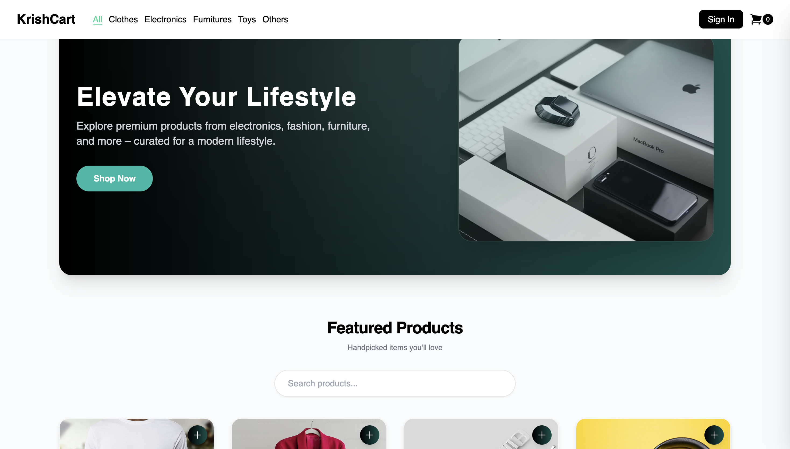
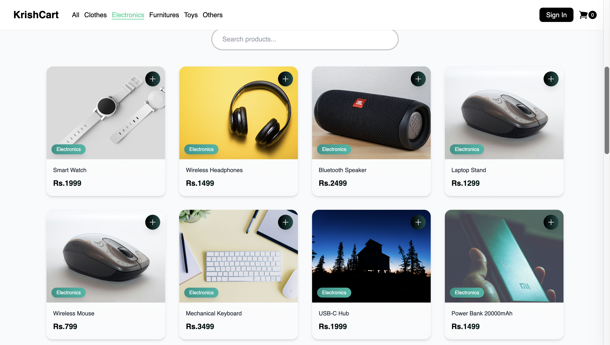
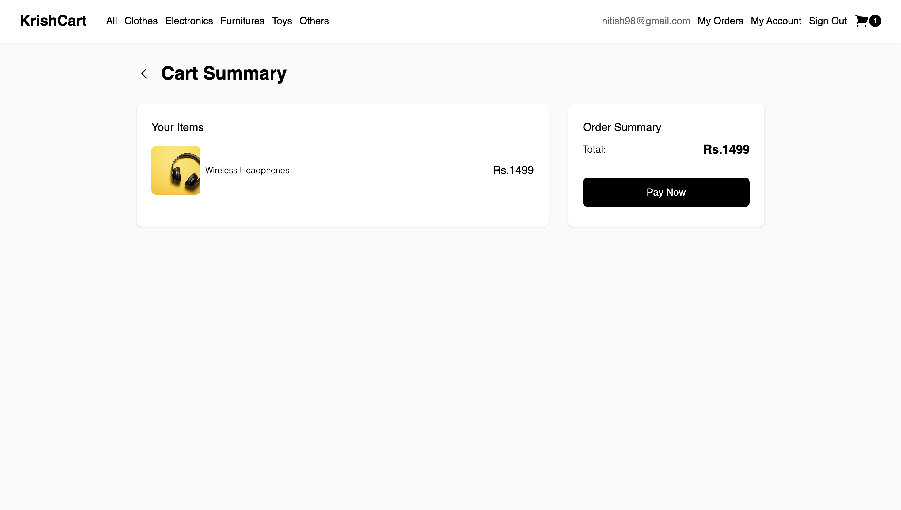
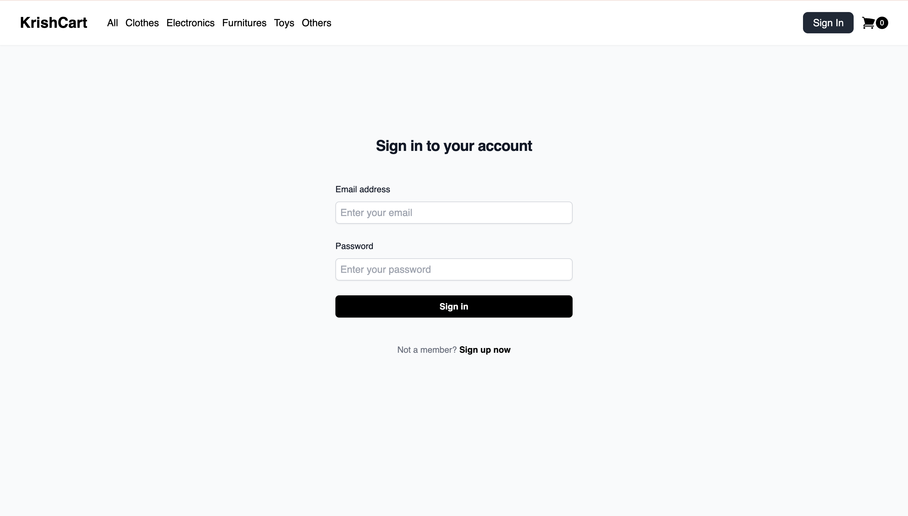
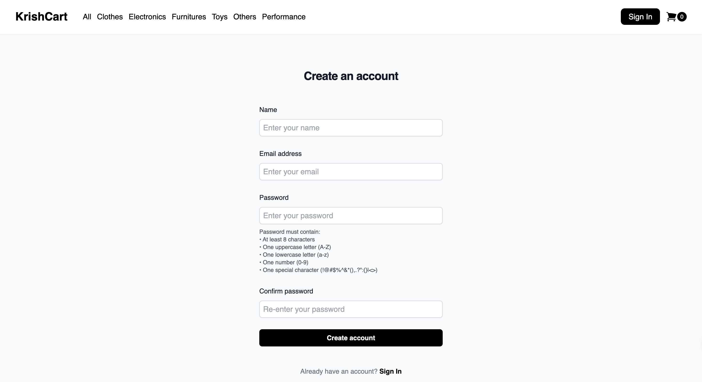

# 🛒 KrishCart - E-Commerce Platform


A **full-stack e-commerce web application** built with React.js and Express.js featuring JWT-based authentication, MongoDB database integration, and a modern responsive UI.

---

## ✨ Features

### 🛍️ E-Commerce Features

- Product listing with category filtering
- Product detail view with specifications
- Shopping cart with add/remove functionality
- Order management and history
- Responsive design for all devices

### 🔐 Authentication & Security

- User registration and login
- JWT (JSON Web Token) based authentication
- Bcrypt password hashing
- Protected routes for authenticated users
- Secure API endpoints with middleware

### 🏗️ Architecture

- RESTful API design
- Global state management with React Context API
- Axios for HTTP requests
- MongoDB for data persistence
- JSON Server for product catalog

---

## 🚀 Tech Stack

### Frontend

| Technology          | Purpose                 |
| ------------------- | ----------------------- |
| React.js 18         | UI Library              |
| Vite                | Build Tool & Dev Server |
| Tailwind CSS        | Styling                 |
| React Router DOM v6 | Client-side Routing     |
| Axios               | HTTP Client             |
| Heroicons           | Icons                   |

### Backend

| Technology | Purpose               |
| ---------- | --------------------- |
| Node.js    | Runtime Environment   |
| Express.js | Web Framework         |
| MongoDB    | Database              |
| Mongoose   | ODM                   |
| JWT        | Authentication        |
| Bcrypt     | Password Hashing      |
| CORS       | Cross-Origin Requests |

### DevOps & Tools

| Technology   | Purpose              |
| ------------ | -------------------- |
| Concurrently | Run Multiple Scripts |
| JSON Server  | Mock Product API     |
| ESLint       | Code Linting         |
| Git          | Version Control      |

---

## 📂 Project Structure

```
KrishCart/
├── backend/                 # Express.js Backend
│   ├── controller/          # Request handlers
│   │   └── authController.js
│   ├── middleware/          # Auth middleware
│   │   └── authMiddleware.js
│   ├── models/              # Mongoose schemas
│   │   └── userModels.js
│   ├── routes/              # API routes
│   │   └── authRoutes.js
│   ├── utils/               # Utilities
│   │   └── jwt.js
│   ├── connection           # MongoDB connection
│   ├── index.js             # Server entry point
│   └── .env                 # Environment variables
│
├── src/                     # React Frontend
│   ├── Components/          # Reusable UI components
│   │   ├── Card/
│   │   ├── CartSummary/
│   │   ├── CheckoutSideMenu/
│   │   ├── Footer/
│   │   ├── Layout/
│   │   ├── Navbar/
│   │   ├── OrderCard/
│   │   ├── ProductDetail/
│   │   └── ProtectedRoute/
│   ├── Pages/               # Page components
│   │   ├── Home/
│   │   ├── MyAccount/
│   │   ├── MyOrder/
│   │   ├── MyOrders/
│   │   ├── SignIn/
│   │   ├── SignUp/
│   │   └── NotFound/
│   ├── Context/             # Global state
│   ├── services/            # API services
│   └── utils/               # Helper functions
│
├── db.json                  # Product data (JSON Server)
├── package.json
└── README.md
```

---

## ⚡ Quick Start

### Prerequisites

- Node.js (v16+)
- npm or yarn
- MongoDB Atlas account (or local MongoDB)

### Installation

1. **Clone the repository**

```bash
git clone https://github.com/Krishnayadav1908/E-Commerce-Website.git
cd E-Commerce-Website
```

2. **Install dependencies**

```bash
# Root dependencies
npm install

# Backend dependencies
cd backend && npm install
```

3. **Configure environment variables**

Create `.env` file in `backend/` folder:

```env
MONGODB_URI=your_mongodb_connection_string
JWT_SECRET=your_jwt_secret_key
PORT=3000
```

4. **Run the application**

```bash
npm start
```

This single command starts:

- 🖥️ React Frontend → `http://localhost:5173`
- 🔧 Express Backend → `http://localhost:3000`
- 📦 JSON Server → `http://localhost:5001`

---

## 🔗 API Endpoints

### Authentication

| Method | Endpoint             | Description                      |
| ------ | -------------------- | -------------------------------- |
| POST   | `/api/auth/register` | Register new user                |
| POST   | `/api/auth/login`    | Login user                       |
| GET    | `/api/protected`     | Protected route (requires token) |

### Products (JSON Server)

| Method | Endpoint        | Description        |
| ------ | --------------- | ------------------ |
| GET    | `/products`     | Get all products   |
| GET    | `/products/:id` | Get single product |

---

## 🔄 Application Architecture

```
┌─────────────────────────────────────────────────────────────────┐
│                         FRONTEND                                 │
│  ┌─────────┐  ┌──────────┐  ┌─────────┐  ┌──────────────────┐  │
│  │ React   │──│  Context │──│  Axios  │──│ React Router DOM │  │
│  │ Pages   │  │   API    │  │         │  │                  │  │
│  └─────────┘  └──────────┘  └────┬────┘  └──────────────────┘  │
└───────────────────────────────────┼─────────────────────────────┘
                                    │ HTTP
┌───────────────────────────────────┼─────────────────────────────┐
│                         BACKEND   │                              │
│  ┌─────────┐  ┌──────────┐  ┌────┴────┐  ┌──────────────────┐  │
│  │ Express │──│  Routes  │──│  JWT    │──│    MongoDB       │  │
│  │ Server  │  │          │  │ + Bcrypt│  │   (Mongoose)     │  │
│  └─────────┘  └──────────┘  └─────────┘  └──────────────────┘  │
└─────────────────────────────────────────────────────────────────┘
```

---

---

## 🖼️ Screenshots

<table>
  <tr>
    <td></td>
    <td></td>
  </tr>
  <tr>
    <td align="center"><b>Home Page - Product Listing</b></td>
    <td align="center"><b>Category Filtering</b></td>
  </tr>
  <tr>
    <td></td>
    <td></td>
  </tr>
  <tr>
    <td align="center"><b>Product Detail View</b></td>
    <td align="center"><b>Shopping Cart</b></td>
  </tr>
  <tr>
    <td></td>
    <td></td>
  </tr>
  <tr>
    <td align="center"><b>Sign In Page</b></td>
    <td align="center"><b>Sign Up Page</b></td>
  </tr>
</table>

---

## 👨‍💻 Key Accomplishments

- Built complete e-commerce frontend with React.js and component-based architecture
- Implemented JWT-based authentication system with secure password hashing
- Designed RESTful API with Express.js following best practices
- Integrated MongoDB database with Mongoose ODM
- Created responsive UI using Tailwind CSS (mobile-first approach)
- Set up efficient development workflow with Vite and Concurrently

---

## 📌 Future Roadmap

- [ ] Payment gateway integration (Stripe/Razorpay)
- [ ] Admin dashboard for product management
- [ ] Order tracking system
- [ ] Email notifications
- [ ] Deploy on Vercel/Railway

---

## 🤝 Contributing

Contributions are welcome! Feel free to open issues or submit pull requests.

---

## 📄 License

This project is licensed under the MIT License - see the [LICENSE](LICENSE) file for details.

---

## 👤 Author

**Krishna Yadav**

- GitHub: [@Krishnayadav1908](https://github.com/Krishnayadav1908)

---

<p align="center">
  Made with ❤️ using React.js & Express.js
</p>
