# 🛒 KrishCart – Full Stack MERN E-Commerce Platform


---

## 🚀 Project Overview

**KrishCart** is a production-ready full-stack e-commerce web application built using the MERN stack.  
It allows users to browse products, register, log in securely using JWT authentication, add items to cart, place orders, and view order history.

All data is persisted in MongoDB Atlas and the application is fully deployed on Render.

---

## 🌐 Live Demo

- 🔗 Frontend: https://e-commerce-website-frontend-kz6e.onrender.com
- 🔗 Backend API: https://e-commerce-website-backend-f1ka.onrender.com

---

## ⚡ Performance Metrics

**Optimized to handle 100+ concurrent users with sub-300ms response times:**

| Metric                   | Result  | Target     |
| ------------------------ | ------- | ---------- |
| **Avg Response Time**    | 22.66ms | < 300ms ✅ |
| **Requests/Second**      | 435+    | 100+ ✅    |
| **P95 Response Time**    | 19ms    | < 500ms ✅ |
| **Success Rate**         | 100%    | > 95% ✅   |
| **Requests Under 300ms** | 98.97%  | > 90% ✅   |
| **Concurrent Users**     | 50+     | 100+ ✅    |

**Run Performance Tests:**

```bash
npm run load-test              # Default: 50 users, 10 seconds
node backend/load-test.js http://localhost:3000 100 30  # Custom: 100 users, 30 seconds
```

**Performance Features:**

- ✅ Server-side caching (5-min TTL for products)
- ✅ Gzip compression (60-70% payload reduction)
- ✅ Database query optimization (indexed, lean queries)
- ✅ Atomic inventory operations (preventing race conditions)
- ✅ Response time tracking middleware
- ✅ HTTP caching headers for browser/CDN caching

See [PERFORMANCE.md](./PERFORMANCE.md) for detailed benchmarks and optimization guide.

---

## ✨ Features

- 🔐 JWT-based Authentication (Register / Login)
- 📧 Email OTP Verification (SMTP)
- 👤 Secure User Profile Route
- 🛍️ Product Listing & Product Details
- 🗂️ Category Filter
- 🛒 Add to Cart & Cart Summary
- ❤️ Wishlist
- 💳 Checkout (Fake Payment Flow)
- 📦 Order Creation & Order History
- 🧾 Invoice Bill Download (PDF)
- 🗄️ MongoDB Atlas Integration
- 🧑‍💼 Admin Dashboard (Analytics, Orders, Products, Users, Audit)
- 📊 Admin Analytics & Revenue Charts
- ⚠️ Low Stock Alert (Admin)
- 📱 Fully Responsive UI (Mobile/Desktop)
- ☁️ Full Deployment on Render
- 📈 Performance & SEO Audit Page
- 🛡️ Security Hardening (Helmet + Rate Limit)
- 🩺 Health Endpoint for Uptime
- 🛠️ Sentry Monitoring (optional)
- ✅ CI Pipeline (Lint + Build + Automated Tests)

---

## 🛠️ Tech Stack

### Frontend

- React.js (Vite)
- Tailwind CSS
- Axios
- React Router DOM
- Context API

### Backend

- Node.js
- Express.js
- MongoDB Atlas
- Mongoose ODM
- JWT Authentication
- Bcrypt Password Hashing

### Testing & Quality

- Jest
- Supertest
- ESLint
- GitHub Actions CI

### Deployment

- Render

---

## 📂 Project Structure

```bash
KrishCart/
├── backend/
│   ├── controller/
│   ├── middleware/
│   ├── models/
│   ├── routes/
│   ├── utils/
│   ├── __tests__/
│   ├── app.js
│   └── index.js
├── src/
│   ├── Components/
│   ├── Context/
│   ├── Pages/
│   └── services/
└── README.md
```

---

## ✅ Testing

Current automated backend tests include:

- Health endpoint tests
- Auth middleware tests
- Products route tests (cache hit/miss + query flow)
- Order controller tests (validation + atomic stock deduction)

Run tests:

```bash
cd backend
npm test -- --runInBand
```

---

## ⚙️ Setup Instructions

### Prerequisites

- Node.js (v16+)
- npm
- MongoDB Atlas Account

---

### 1️⃣ Clone Repository

```bash
git clone https://github.com/Krishnayadav1908/E-Commerce-Website.git
cd E-Commerce-Website

```

### 2️⃣ Install Dependencies

```bash
# Backend
cd backend
npm install

# Frontend
cd ../react-ecommerce
npm install
```

### 3️⃣ Environment Variables

Create `.env` file inside the `backend/` folder:

```bash
MONGODB_URI=your_mongodb_connection_string
JWT_SECRET=your_secret_key
PORT=3000
SENTRY_DSN=your_sentry_dsn (optional)

# SMTP Email Configuration (for OTP, notifications, etc.)
SMTP_HOST=smtp.gmail.com
SMTP_PORT=587
SMTP_USER=your_email@gmail.com
SMTP_PASS=your_app_password
SMTP_FROM="KrishCart <your_email@gmail.com>"
SMTP_DEBUG=false
OTP_RESEND_COOLDOWN_SECONDS=60
OTP_LOCKOUT_MINUTES=15
```

> **Note:** For Gmail, you must use an App Password (not your normal password). Enable 2FA in your Google account and generate an App Password for SMTP.

Create `.env` inside `react-ecommerce/`:

```bash
VITE_API_URL=http://localhost:3000
VITE_SENTRY_DSN=your_sentry_dsn (optional)
VITE_SENTRY_TRACES_SAMPLE_RATE=0.1 (optional)
```

### 4️⃣ Run Application

#### ▶ Start Backend

```bash
cd backend
node index.js
```

> **Troubleshooting SMTP:**
>
> - Render and most free cloud hosts block SMTP ports. For local testing, SMTP will work. For production, use a VPS or a transactional email API (Mailgun, Resend, etc.).
> - If you get connection timeout or authentication errors, check your SMTP credentials and network restrictions.

#### ▶ Start Frontend

```bash
cd ../react-ecommerce
npm run dev
```

Frontend → http://localhost:5173  
Backend → http://localhost:3000

> **Note:** Due to SMTP port restrictions on Render, the Email/OTP feature will not work in the live demo. This feature is fully functional when running locally or on a VPS (Virtual Private Server). For a complete demo of email/OTP, please run the backend on your local machine or a VPS.

---

## 🔗 API Endpoints (34+ endpoints)

### 🔐 Authentication (9 endpoints)

- **POST** `/api/auth/register` – Register new user
- **POST** `/api/auth/login` – Login user
- **POST** `/api/auth/verify-otp` – Verify email OTP
- **POST** `/api/auth/resend-otp` – Resend OTP
- **POST** `/api/auth/refresh` – Refresh access token
- **POST** `/api/auth/logout` – Logout user
- **GET** `/api/auth/profile` – Get user profile (protected)
- **PUT** `/api/auth/profile` – Update profile (protected)
- **PUT** `/api/auth/change-password` – Change password (protected)

### 🛍️ Products (1 endpoint)

- **GET** `/api/products` – Fetch products with filters, search, pagination
  - Query params: `page`, `limit`, `search`, `category`, `minPrice`, `maxPrice`

### 📦 Orders (3 endpoints)

- **POST** `/api/order/create` – Create new order (protected)
- **GET** `/api/order/user/:userId` – Get user's orders (protected)
- **GET** `/api/order/:orderId/invoice` – Download invoice PDF (protected)

### 💳 Payment (1 endpoint)

- **POST** `/api/payment/create-payment-intent` – Create payment intent

### 🧑‍💼 Admin (18 endpoints - requires admin role)

- **GET** `/api/admin/stats` – Dashboard statistics
- **GET** `/api/admin/orders` – Get all orders
- **PATCH** `/api/admin/orders/:orderId/status` – Update order status
- **PATCH** `/api/admin/orders/:orderId/payment` – Update payment status
- **GET** `/api/admin/users` – Get all users
- **PATCH** `/api/admin/users/:userId/role` – Update user role
- **GET** `/api/admin/products` – Get all products
- **GET** `/api/admin/products/low-stock` – Get low stock products
- **POST** `/api/admin/products` – Create product
- **PATCH** `/api/admin/products/:productId` – Update product
- **DELETE** `/api/admin/products/:productId` – Delete product
- **GET** `/api/admin/audit` – Get audit logs
- **GET** `/api/admin/email-logs` – Get email logs
- **POST** `/api/admin/email-logs/:logId/retry` – Retry failed email
- **GET** `/api/admin/analytics/summary` – Analytics summary
- **GET** `/api/admin/analytics/revenue-trend` – Revenue trend data
- **GET** `/api/admin/analytics/top-products` – Top products
- **GET** `/api/admin/analytics/category-breakdown` – Category breakdown

### 🩺 Health & Monitoring (2 endpoints)

- **GET** `/api/health` – Health check
- **GET** `/api/metrics/performance` – Performance metrics (avg response time, p95, p99, etc.)

---

## 🏗️ Application Architecture

```text
Frontend (React + Context API)
  |
  v
Axios HTTP Requests
  |
  v
Backend (Express REST API)
  |
  v
JWT + Middleware Layer
  |
  v
MongoDB Atlas (Mongoose)
```

---

## 📊 Performance & SEO

Visit `/performance` to view the audit summary and notes.
See [PERFORMANCE.md](./PERFORMANCE.md) for load-test benchmarks and optimization details.

---

## 🔐 Security & Monitoring

- Helmet headers enabled
- Auth rate limiting for login/register/OTP
- Optional Sentry error tracking (backend `SENTRY_DSN`, frontend `VITE_SENTRY_DSN`)
- Health endpoint for uptime checks

---

<table>
  <tr>
    <td>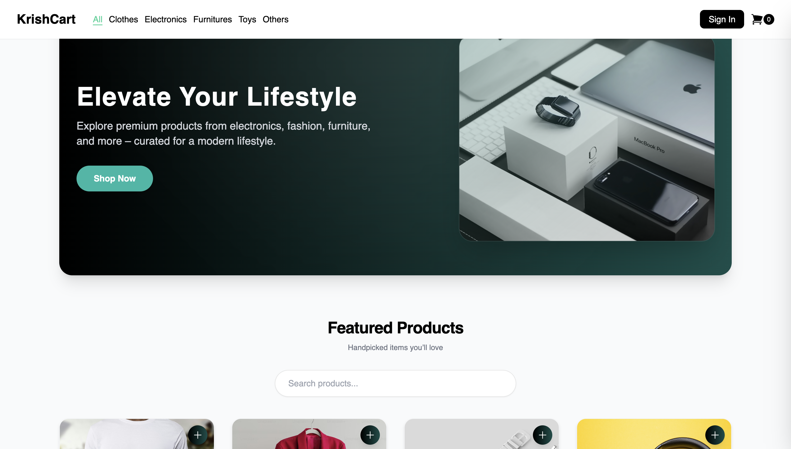</td>
    <td>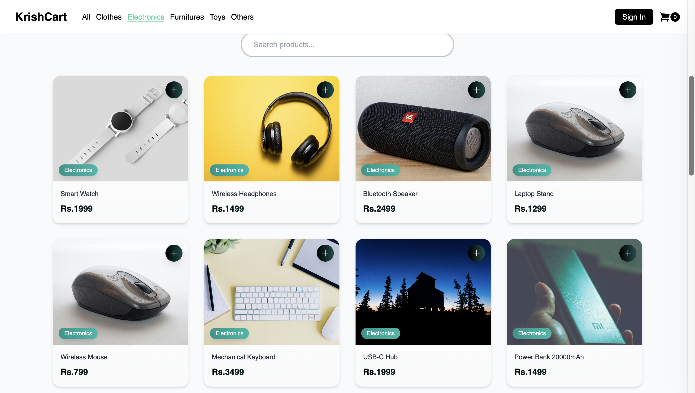</td>
  </tr>
  <tr>
    <td align="center"><b>Home - Product Listing</b></td>
    <td align="center"><b>Category Filter</b></td>
  </tr>
  <tr>
    <td></td>
    <td>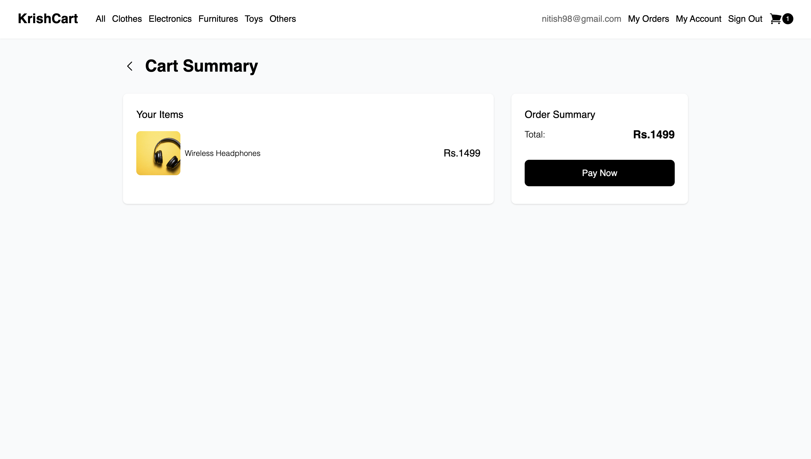</td>
  </tr>
  <tr>
    <td align="center"><b>Product Detail</b></td>
    <td align="center"><b>Shopping Cart</b></td>
  </tr>
  <tr>
    <td>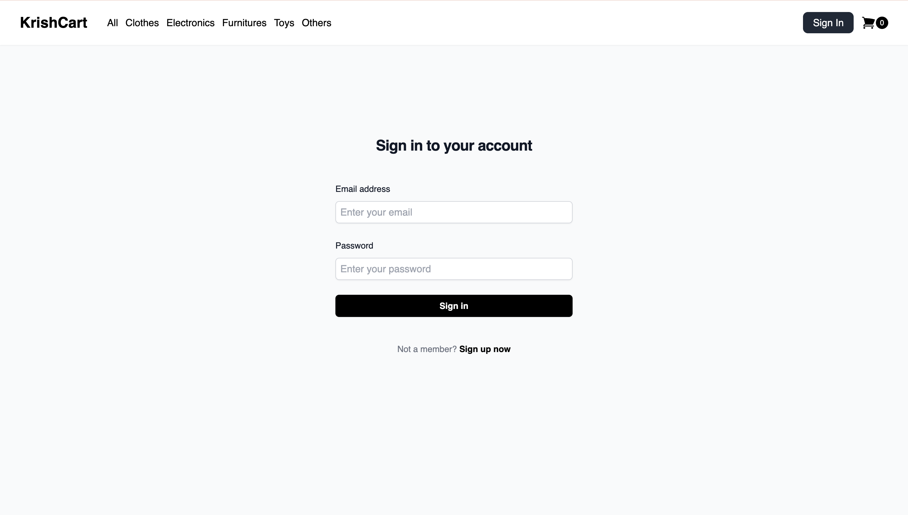</td>
    <td>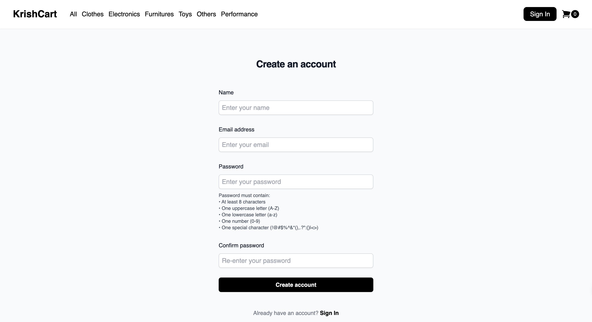</td>
  </tr>
  <tr>
    <td align="center"><b>Sign In Page</b></td>
    <td align="center"><b>Sign Up Page</b></td>
  </tr>
  <tr>
    <td>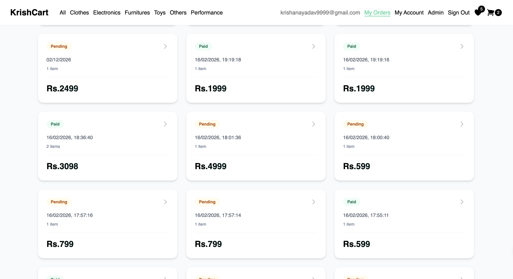</td>
    <td>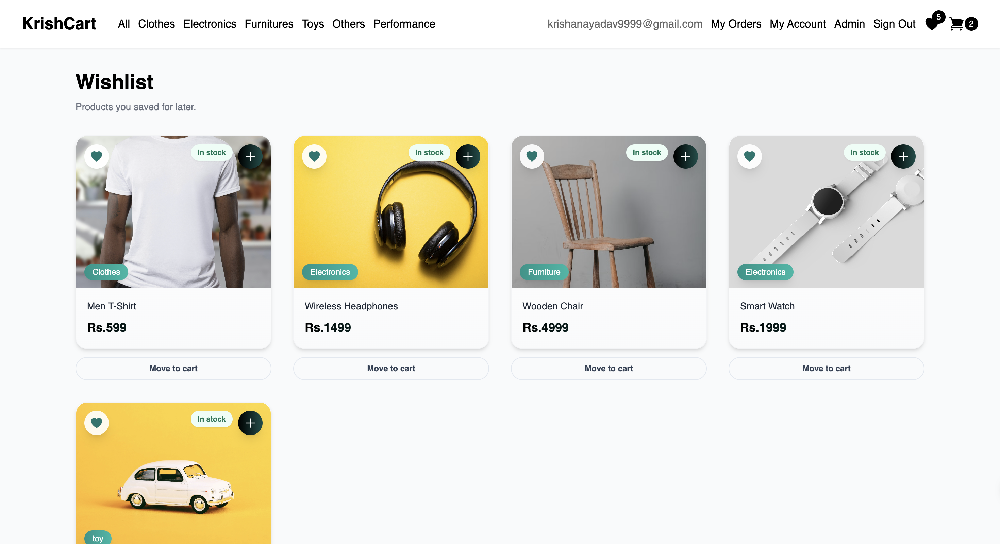</td>
  </tr>
  <tr>
    <td align="center"><b>Order History</b></td>
    <td align="center"><b>Wishlist</b></td>
  </tr>
  <tr>
    <td>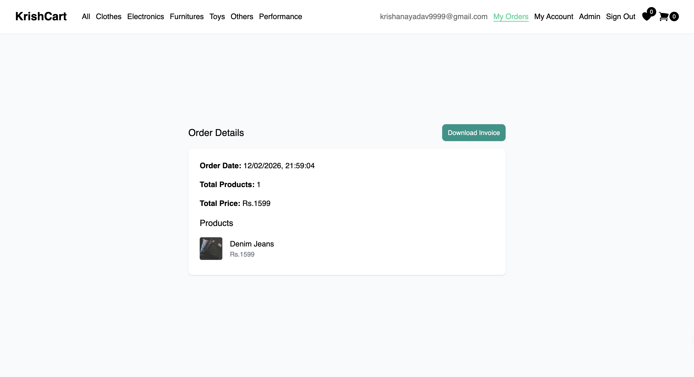</td>
    <td>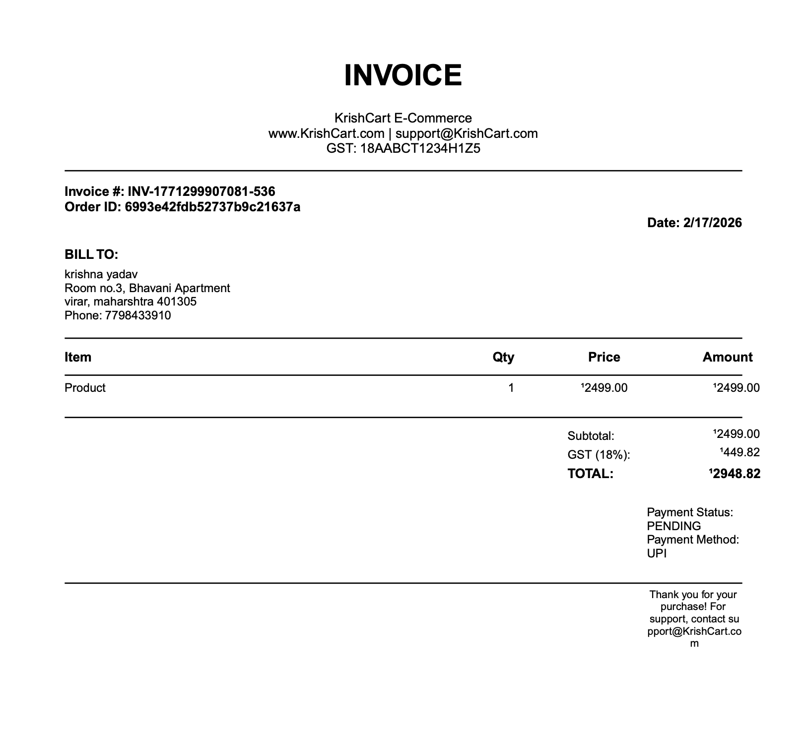</td>
  </tr>
  <tr>
    <td align="center"><b>invoice download button</b></td>
    <td align="center"><b>Invoice Download</b></td>
  </tr>
  <tr>
    <td>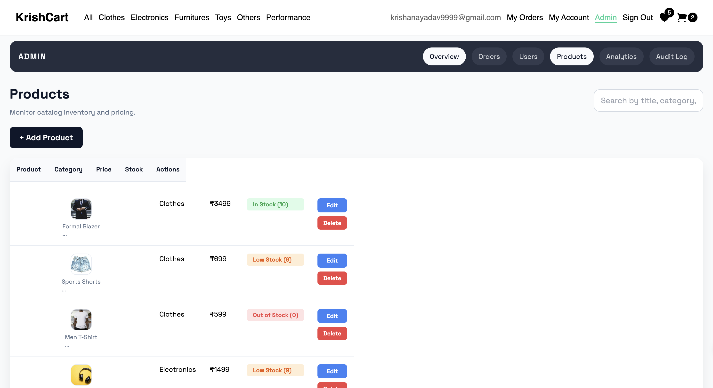</td>
    <td>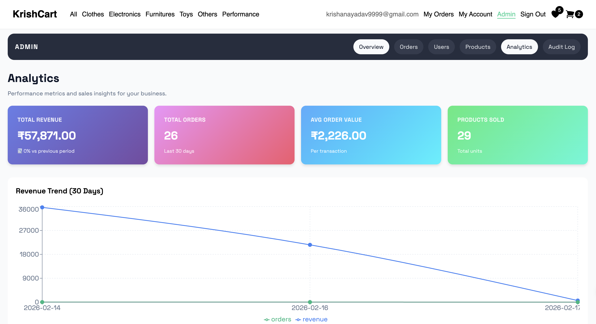</td>
  </tr>
  <tr>
    <td align="center"><b>Stock Manage</b></td>
    <td align="center"><b>Admin Analytics</b></td>
  </tr>
  <tr>
    <td>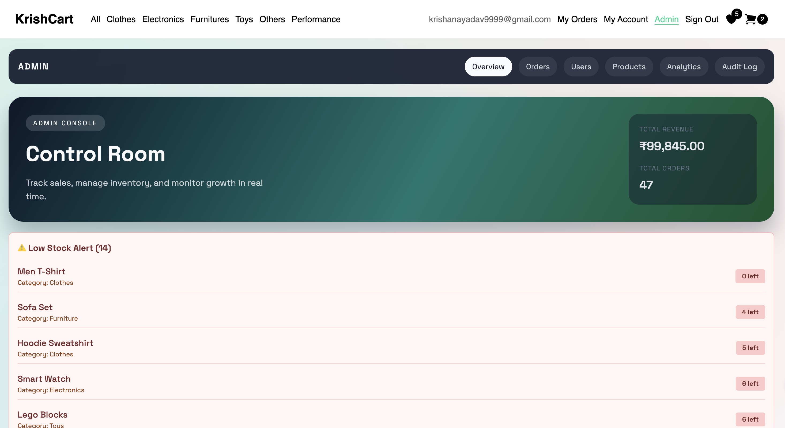</td>
    <td>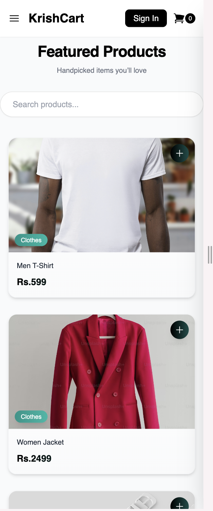</td>
  </tr>
  <tr>
    <td align="center"><b>Low Stock Alert</b></td>
    <td align="center"><b>Mobile View</b></td>
  </tr>
</table>

---

### 🗄️ MongoDB Database (Atlas)

<p align="center">
  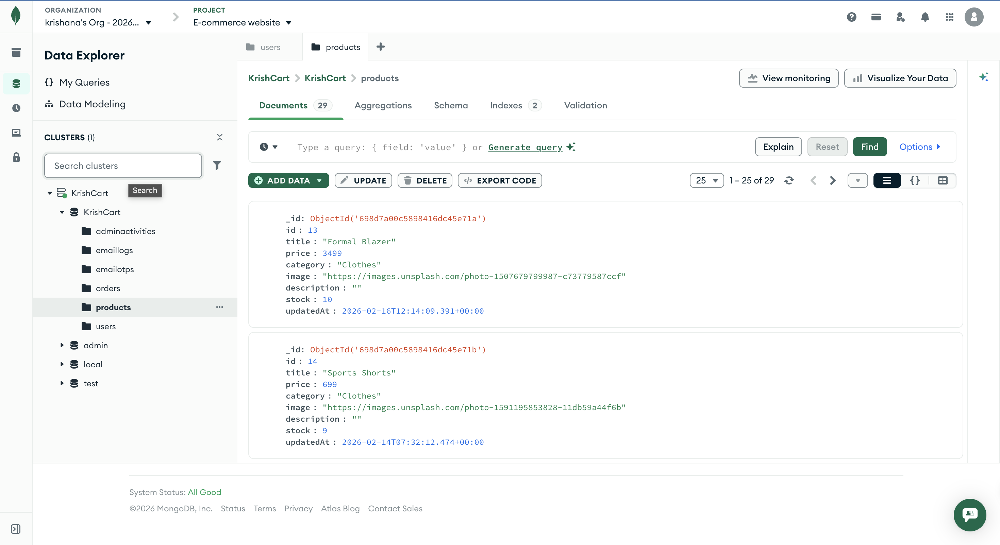
</p>

<p align="center">
  <b>Users & Orders Collection Stored in MongoDB Atlas</b>
</p>

---

👨‍💻 Key Accomplishments

- Built complete MERN stack application from scratch
- Implemented secure authentication with JWT & Bcrypt
- Designed RESTful APIs following best practices
- Integrated MongoDB Atlas for persistent data storage
- Created responsive mobile-first UI using Tailwind CSS
- Implemented email OTP verification using SMTP
- Developed admin dashboard with analytics, revenue charts, and low stock alerts
- Added wishlist, order history, and invoice bill download (PDF) features for users
- Applied security best practices (Helmet, rate limiting)
- Added health endpoint and Sentry monitoring for reliability
- Successfully deployed full-stack project

📄 License

This project is licensed under the MIT License.

👤 Author

Krishna Yadav

GitHub: https://github.com/Krishnayadav1908
